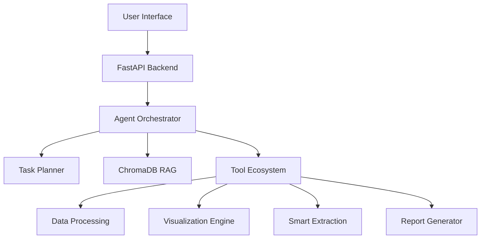

# ThermoSense

**Agentic AI for Automated Thermal Data Analysis and Visualization**


ThermoSense is an advanced AI platform designed to streamline the workflow of thermal engineers. By integrating Large Language Models (LLMs) with a specialized tool ecosystem, it automates data extraction, analysis, visualization, and reporting.

---

## System Architecture

The system is built on a modular architecture that separates the user interface, backend processing, and agentic reasoning layers.



### Core Components

1.  **Agent Orchestrator**: The central brain that interprets user intent, manages context, and delegates tasks. It uses a "Reason-Plan-Act" loop to solve complex problems.
2.  **Task Planner**: Decomposes high-level requests (e.g., "Analyze this test run") into a sequence of executable steps.
3.  **Tool Ecosystem**: A collection of deterministic Python functions that the agent can execute to perform specific actions like reading Excel files or generating Plotly charts.
4.  **RAG Memory**: Vector storage (ChromaDB) that allows the agent to retrieve relevant historical data and context.

---

## Key Features

### Agentic Intelligence
ThermoSense goes beyond simple Q&A. It acts as an autonomous agent that can:
*   **Reason** about data relationships.
*   **Plan** multi-step analysis workflows.
*   **Execute** code to manipulate data.
*   **Verify** its own results before presenting them.

### Smart Visualization
*   **Auto-Plotting**: The system automatically determines the most appropriate visualization (Line, Scatter, Heatmap) based on the data structure.
*   **Interactive Charts**: All generated charts are interactive, allowing users to zoom, pan, and inspect individual data points.

### Automated Reporting
*   **Instant Documentation**: Generates professional PDF or Markdown reports summarizing the analysis session.
*   **Technical Insights**: The AI automatically generates technical commentary, identifying trends, anomalies, and key statistics.

---

## User Manual

### Getting Started

1.  **Launch the Application**:
    Ensure the backend server is running and navigate to `http://localhost:8000`.

2.  **Upload Data**:
    Click the attachment icon to upload your thermal data files (Excel, CSV, or PDF). The system will automatically index the file contents.

3.  **Ask Questions**:
    Interact with the bot using natural language. Examples:
    *   "Plot the temperature profile for Sensor A."
    *   "Compare the inlet and outlet temperatures."
    *   "Find the maximum temperature recorded in the test."

### Advanced Workflows

*   **Comparison**: To compare two different datasets, upload both files and ask: "Compare the temperature trends between File A and File B."
*   **Report Generation**: Once you have completed your analysis, simply type "Generate a report" to download a summary document.

---

## Installation

### Prerequisites
*   Python 3.10 or higher
*   Git

### Setup Steps

1.  **Clone the Repository**
    ```bash
    git clone https://github.com/SahilPatil07/ThermoSense.git
    cd ThermoSense
    ```

2.  **Install Dependencies**
    ```bash
    pip install -r requirements.txt
    ```

3.  **Run the Server**
    ```bash
    python backend/main.py
    ```

---

## Contributing

We welcome contributions to improve ThermoSense. Please fork the repository and submit a pull request with your changes.

---

Feel free to reach out, I'll explain.
